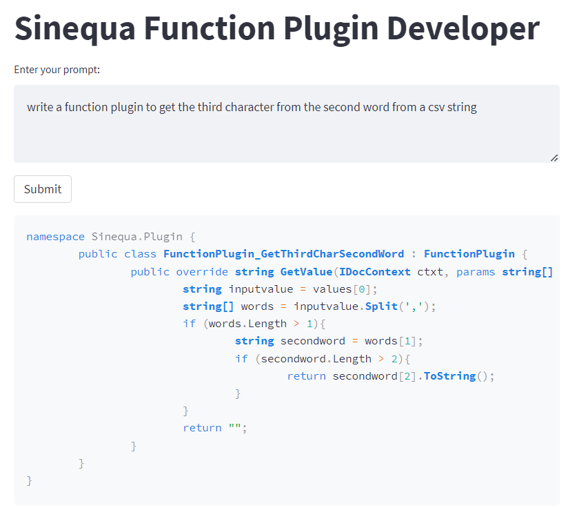
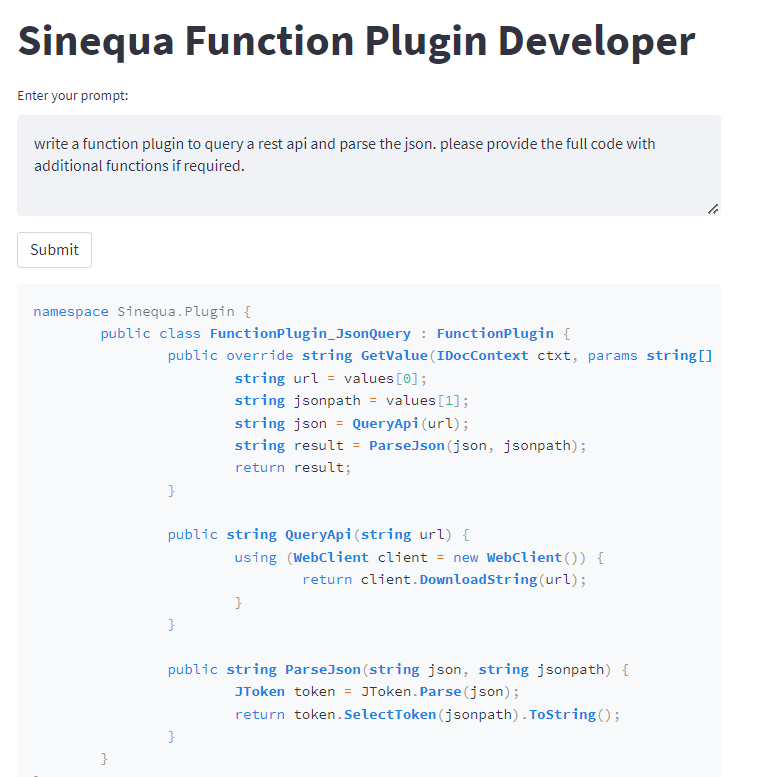

# Sinequa Function Plugin Developer 📝

A Streamlit application that interacts with OpenAI's GPT-3.5 Turbo model to generate function plugins in C# for Sinequa.

## Features 🚀

- **User-Friendly Interface**: Just type in your prompt and get instant C# code responses.
- **Integration with GPT-3.5 Turbo**: Uses the advanced capabilities of OpenAI's model for code generation.

## Prerequisites

- Python 3.7 or higher
- Streamlit
- langchain

## Installation

1. **Clone the Repository**:

   `git clone https://github.com/shravanv90/SinequaFunctionPluginDev.git`

   `cd SinequaFunctionPluginDev`

2. **Set Up a Virtual Environment (Optional but Recommended)**:

   python -m venv venv
   source venv/bin/activate` On Windows use venv\Scripts\activate

3. **Install the Dependencies**:

   `pip install streamlit langchain`

4. **Add Your OpenAI API Key:**

   Replace the placeholder in the code with your actual OpenAI API key:
   OPENAI_API_KEY = "YOUR_OPENAI_API_KEY"

## Usage:

### Run the Streamlit App:

`streamlit run app.py`

Input your Prompt: Type in your desired prompt and hit 'Submit' to receive a C# function plugin code.
Copy code

#### Important Notes:

Ensure that you never expose your OpenAI API Key in public repositories.
Be mindful of the rate limits and costs associated with the OpenAI API when deploying this app.
